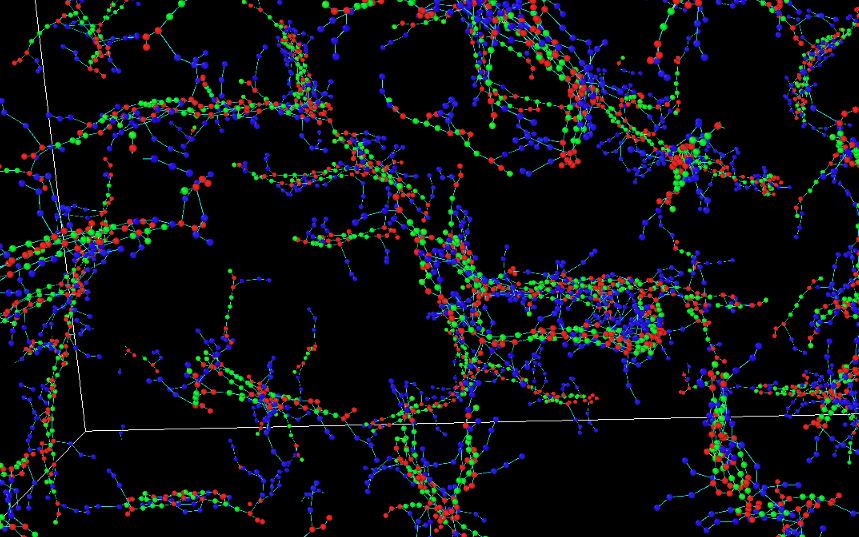

# ClusterAnalyzer
Analyze Clusters in LAMMPS Polymerization Simulations

## Context:
I work with multiscale modeling. In particular, I use Coarse Graining (CG) to simplify protein molecular dynamics (MD) simulations and accelerate them. One problem I am particularly interested in is the polymerization of the plasma protein fibrinogen, which essentially forms a fiber net serving as the scaffold for blood clots. Its role in blood coagulation is cruicial, with positive (blood clot following an injury) and negative (heart attack) outcomes. I use LAMMPS to run Ultra Coarse Grained (UCG) MD simulations with our customized force field. Like other MD simulation software, LAMMPS allows dynamic bond formation.

<p align="center">
  
</p>

Fibrin monomers form clusters, protofibrils and then laterally aggregate into oligomers. Visualization were done in OVITO.

To identify clusters, the code uses concepts from **graph theory**. In particular, vertices represent molecules, while edges represent intermolecular bonds. The implementation makes use of **depth-first search (DFS)** to identify connected components, their size, and the corresponding average diameter.

## Goal:
I want to be able to analyze the results of these simulations, in particular with regards to clustering and dynamic bond formation. This repository is designed to read a directory of files containing snapshot information about bonds and CG bead coordinates to compute quantities like:
- Cluster sizes
- Cluster diameter
- Density
*As I update this repository, I want to be able to embed more polymerization-related metrics, and hopefully a friendier interface. Also, I would like to incorporate a faster implementation using multithreading.*

<p align="center">
  
</p>
An examples of a possible output -- visualizing the results of our cluster analysis.

## Assumptions:
- Access to `.data` files -- we present a quick method to transform `.restart` files to `.data`.
- The files are labelled by their timestep -- the number is between the first "-" and ".", e.g. `fibri-640000.data`.

## Dependencies (for now):
- `numpy`
- `json`
- `matplotlib`

## Implementation:
First, you can create the Python environment with the above libraries. Then, you clone the repository, and run the code:
```
git clone ...

cd ClusterAnalyzer

python clustering.py
```
Make sure to edit the `sample_config.json` file in the `./configs` directory, to modify the input/output path and filenames, as well as some other parameters. Then you can run the `analyze_clusters.ipynb` notebook to create the plots.

*More updates to come, this is a work in progress...*